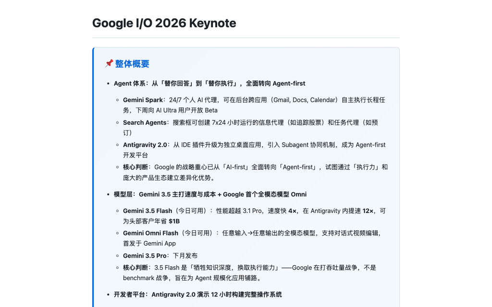
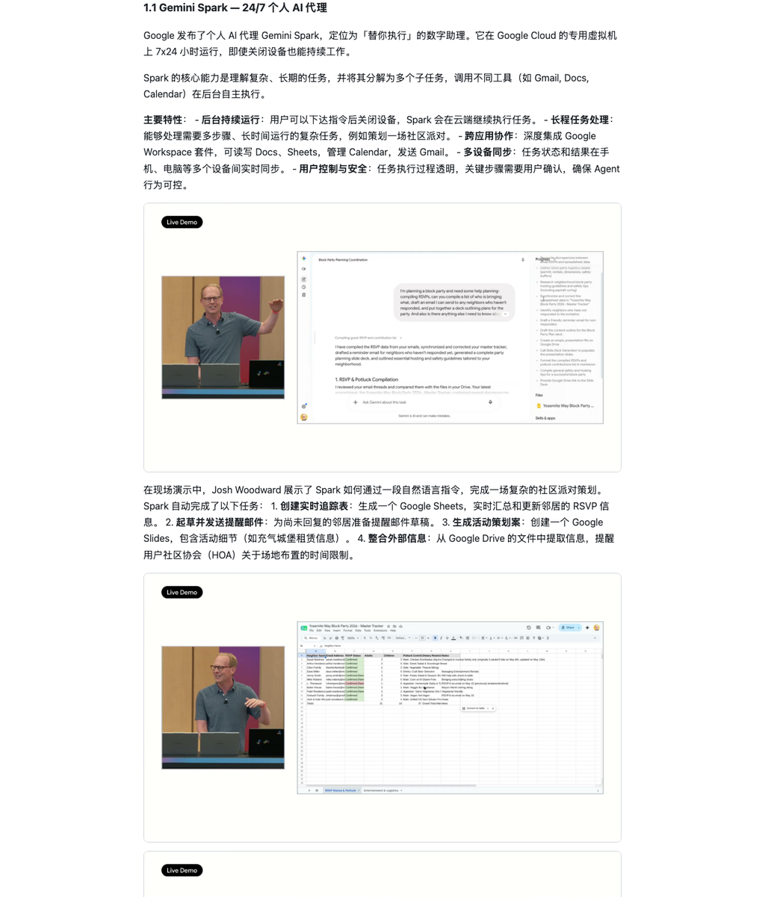

# keynote-recap

> 把 1.5 小时科技发布会 → 一份飞书友好的图文复盘简报。

[](https://github.com/Scarlett9826/keynote-recap/actions/workflows/ci.yml)
[](LICENSE)


<p align="center">
  
  <br>
  <em>↑ Google I/O '26 实测产出（v10）：飞书友好的整体概要 callout + 分层叙述</em>
</p>

<p align="center">
  
  <br>
  <em>↑ 每个产品板块至少 1 张关键帧（自动从 1080p60 视频抽取）</em>
</p>

---

> **协作者请先读 [USAGE.md](USAGE.md)** —— 给定任意发布会链接如何在 30 分钟内产出高质量复盘的完整指南。

## 5 分钟上手

```bash
# 1. 安装
pip install keynote-recap

# 2. 配置 LLM（任意 OpenAI 兼容 endpoint）
export OPENAI_API_KEY=sk-xxx
export OPENAI_BASE_URL=https://api.openai.com/v1   # 或 anthropic/zhipu/etc.
export KEYNOTE_RECAP_MODEL=claude-opus-4

# 3. 跑一份复盘
keynote-recap recap https://www.youtube.com/watch?v=wYSncx9zLIU \
  --output-dir ./io26 \
  --keep-video

# 4. 输出
# ./io26/report.md           — 中文 markdown 复盘（600-900 行）
# ./io26/report.html         — 自包含 HTML（base64 内嵌图，飞书可直接粘贴）
# ./io26/frames/             — 抽帧图
# ./io26/research_notes.md   — 联网补充信源的事实清单
```

---

## 这是什么

`keynote-recap` 是一个端到端流水线，把 YouTube / Bilibili 上的科技发布会视频，转成一份**符合工程师阅读习惯的中文复盘简报**。

特点：

- ✅ **每板块至少 1 张关键帧图**（不是营销 slogan / 不是转场页）
- ✅ **三种来源严格区分**：字幕原话 / 联网补充 / 独立判断
- ✅ **数据驱动叙事**：「时间→数据」三段对比序列，反夸张词
- ✅ **飞书友好**：HTML 自包含 base64 图，可直接粘贴飞书文档
- ✅ **OpenAI 兼容 endpoint**：用户自由换 LLM（Claude / GPT / 智谱 / 通义 / ...）
- ✅ **可插拔 search provider**：Tavily / 直接用 webfetch / 自定义

## 为什么不直接用 video-recap

[video-recap](https://github.com/bytedance/video-recap)（同作者另一个项目）面向**通用视频复盘**（演讲 / 访谈 / 教程 / 发布会四类）。

`keynote-recap` 是**面向发布会的专门版本**，相比 video-recap 多做 7 件事：

| 增量 | 解决什么问题 |
|---|---|
| Stage 4 独立 research 阶段 | 联网交叉验证产品名 / 版本号 / 价格 |
| Stage 5.5 三步质检 | 章节图覆盖 + caption 真实性 + 反 AI 套话 |
| 二级筛图链路 | frame_scorer 初筛 + Vision LLM 三原则精筛 |
| 整体概要 callout | 飞书友好的折叠式概要框 |
| 「一点观察」独立章节 | 强制独立判断与字幕分离 |
| 透明声明节 | 主动声明「未查到」的事实 |
| anti-AI lint | 静态检查反 emoji / 反夸张 / 反套话 |

## 7 阶段流水线

```
Stage 1: download (yt-dlp 1080p60)
   └─→ video.mp4 + subtitles.vtt

Stage 2: segment (字幕分段 + frame_scorer.py PIL 初筛)
   └─→ ~80 candidate frames

Stage 3: extract (Vision LLM 三原则筛图)
   └─→ ~40 selected frames + captions + section assignments

Stage 4: research (web_search + webfetch 联网交叉验证)
   └─→ research_notes.md（含已查证事实 + 未查到清单 + URL 列表）

Stage 5: draft (3 steps: outline → write → callout)
   └─→ report.md (with `<div class="callout">` 整体概要)

Stage 5.5: verify (3 sub-steps)
   ├─ 5.5.1 coverage check（每章节 ≥ 1 图，A8 硬约束）
   ├─ 5.5.2 caption verify（Vision LLM 重读核对 caption）
   └─ 5.5.3 anti-AI lint（正则扫禁用词）

Stage 6: render (markdown → HTML，base64 内嵌图)
   └─→ report.html（自包含，飞书友好）

Stage 7: publish (可选)
   └─→ 复制到飞书文档 / GitHub Pages / etc.
```

每两个阶段间有可选 checkpoint，允许人工审核后继续。

## 配置

完整配置见 [docs/configuration.md](docs/configuration.md)。

```yaml
# ~/.config/keynote-recap/config.yaml

llm:
  provider: openai-compatible
  base_url: https://api.openai.com/v1
  api_key_env: OPENAI_API_KEY
  models:
    extract: claude-sonnet-4   # 抽帧筛图（vision）
    research: gpt-4o-mini       # 联网查证（轻量）
    draft: claude-opus-4        # 主写作（重型）
    verify: claude-sonnet-4     # 5.5 质检

search:
  provider: duckduckgo           # duckduckgo（默认零 key）| tavily | webfetch_only | custom
  # api_key_env: TAVILY_API_KEY  # 仅 tavily 需要
  max_queries: 30

video:
  resolution: 1080p60            # 默认下载档
  keep_video: true               # 默认保留（重跑零成本）

stages:
  start: 1
  end: 7
  checkpoints: [3, 4, 5.5]       # 在这些阶段后暂停，等 user confirm
```

## 项目状态

当前在 **M2（质量基线）** 阶段：

| Milestone | 状态 | 详情 |
|---|---|---|
| M0 | ✅ 完成 | 25 份文档（requirements / methodology / prompts / examples） |
| M1 | ✅ 完成 | 18 个源文件 + 21 个单元测试全过 |
| M2 | ✅ 完成 | 真实端到端产出 vs 黄金标准对比 |
| M3 | 🚧 进行中 | UX 抛光 + CI + PyPI 发布准备 |
| M4 | ⬜ 待启动 | PyPI 发布 |

### M2 质量基线（Google I/O 2026 Keynote）

| 指标 | 黄金标准（人工） | M2 v10（CLI） | 达成率 |
|---|---|---|---|
| 行数 | 783 | 486 | 62% |
| 章节数 | 14 | 11 | 79% |
| 图数 | 35 | 19 | 54% |
| 引用数 | — | 11 | ✓ (≥ 8) |
| L1 lint 错误 | 0 | 0 | ✓ |
| L2 lint 警告 | 0 | 0 | ✓ |
| Caption 错误 | 0 | 0 | ✓ |
| Filename 错误 | 0 | 0 | ✓ |
| 单次运行成本 | ~$6（人工时间） | ~$0.20-0.50（LLM） | — |
| 单次运行耗时 | ~6 小时 | ~15-25 分钟 | — |

**已解决的核心问题**：
- ✅ Callout 不再被代码围栏包裹
- ✅ 章节切分从 7 节提升到 11 节（产品名自动检测）
- ✅ Lint L1+L2 全清零（禁用词零容忍）
- ✅ Caption 中文化强制 + 视觉验证
- ✅ 图文件名严禁编造（whitelist 验证）
- ✅ 5.5.0 图存在性检查 + auto-fix 补图

**已知局限**：
- ⚠ 图覆盖率：5/11 章节仍缺图（auto-fix 部分生效）
- ⚠ Research 质量：DuckDuckGo 搜索精度有限（建议用 Tavily）
- ⚠ 行数：486 vs 783（章节合并导致内容偏短）

详细路线图见 [docs/plans/2026-05-21-implementation-plan.md](docs/plans/2026-05-21-implementation-plan.md)。

## 文档导航

| 文档 | 用途 |
|---|---|
| [USAGE.md](USAGE.md) | **复用指南**：丢一个新发布会链接如何高质量复盘 |
| [docs/configuration.md](docs/configuration.md) | **完整配置指南**（所有参数 + 示例） |
| [docs/requirements.md](docs/requirements.md) | **单一真相源**：38 条用户消息溯源 + 隐式偏好 + 资产清单 |
| [docs/methodology.md](docs/methodology.md) | 方法论完整说明（结构 / 来源 / 视觉 / 文风 4 层） |
| [methodology/filter-three-principles.md](methodology/filter-three-principles.md) | 筛图三原则详解 |
| [methodology/style-rules.md](methodology/style-rules.md) | 文风规则（反 AI 套话 + 数据驱动） |
| [methodology/source-attribution.md](methodology/source-attribution.md) | 三种来源严格区分 |
| [methodology/anti-ai-lint.md](methodology/anti-ai-lint.md) | 反 AI 套话静态检查清单 |
| [methodology/report-skeleton.md](methodology/report-skeleton.md) | 报告骨架样例 |
| [docs/plans/2026-05-21-keynote-recap-design.md](docs/plans/2026-05-21-keynote-recap-design.md) | 7 阶段架构设计 |
| [docs/plans/2026-05-21-implementation-plan.md](docs/plans/2026-05-21-implementation-plan.md) | 4 milestone 实施计划 |
| [docs/examples/io26-keynote-recap.md](docs/examples/io26-keynote-recap.md) | **黄金标准产出**（781 行 / 47 图） |
| [prompts/](prompts/) | 9 份 stage prompts |

## License

MIT — see [LICENSE](LICENSE).

## Acknowledgements

本项目脱胎于一次 Google I/O '26 Keynote 的手工复盘（耗时 ~6 小时，38 轮迭代），把过程中积累的方法论沉淀为可复用 CLI。详细溯源见 [docs/requirements.md](docs/requirements.md)。
